# Pipeline de Extração de Respostas em Folhas de Gabarito

#### Aluno: [Gustavo Teixeira](https://github.com/gustavoteixeirah)
#### Orientador: [Vitor](https://github.com/link_do_github).

---

Trabalho apresentado ao curso [VC MASTER](https://ica.puc-rio.ai/vc-master) como pré-requisito para conclusão de curso e obtenção de crédito na disciplina "Projetos de Sistemas Inteligentes de Apoio à Decisão".

<!-- para os links a seguir, caso os arquivos estejam no mesmo repositório que este README, não há necessidade de incluir o link completo: basta incluir o nome do arquivo, com extensão, que o GitHub completa o link corretamente -->


- Trabalhos relacionados: <!-- caso não aplicável, remover estas linhas -->
    - [Detecção de marcação de alternativas em formulários de questões para concursos](https://drive.google.com/file/d/1NPTECqFM5xpu0C4clAt04zpOSQvAXz0A/view?usp=sharing).
    - [Debugattor](https://github.com/gustavoteixeirah/debugattor).

---
### Resumo

Este trabalho apresenta o desenvolvimento de uma pipeline de visão computacional para a extração automática de respostas marcadas em folhas de gabarito (answer sheets) de provas de múltipla escolha. O sistema recebe como entrada uma fotografia da folha de respostas preenchida pelo aluno, capturada por dispositivo móvel ou digitalizada, e retorna a relação de alternativas marcadas para cada questão (letras de A a E). A saída contempla diferentes cenários: uma única alternativa marcada, múltiplas alternativas marcadas na mesma questão, nenhuma alternativa marcada, ou falha na detecção. A solução combina técnicas clássicas de processamento de imagens, como transformação de perspectiva, detecção de bordas (Canny) e Transformada Circular de Hough, com modelos modernos de deep learning baseados na arquitetura YOLO (You Only Look Once) para detecção de objetos. O pipeline inclui etapas de alinhamento da imagem, detecção e decodificação de QR Code para identificação do modelo de gabarito, localização de grupos de questões, detecção de círculos marcados e não marcados, e reconhecimento óptico dos números das questões. O sistema foi projetado visando baixo custo computacional, baixa latência e alta confiabilidade, sendo aplicável como componente de sistemas educacionais que necessitam extrair respostas de provas objetivas em larga escala.

### Abstract

This work presents the development of a computer vision pipeline for automatic extraction of marked answers from multiple-choice answer sheets. The system receives as input a photograph of a filled answer sheet, captured by a mobile device or scanned, and returns the list of marked alternatives for each question (letters A through E). The output covers different scenarios: a single marked alternative, multiple alternatives marked for the same question, no marked alternative, or detection failure. The solution combines classical image processing techniques, such as perspective transformation, edge detection (Canny), and Hough Circle Transform, with modern deep learning models based on the YOLO (You Only Look Once) architecture for object detection. The processing pipeline includes image alignment stages, QR Code detection and decoding to identify the answer sheet template, localization of question groups, detection of marked and unmarked circles, and optical character recognition of question numbers. The system was designed with a focus on low computational cost, low latency, and high reliability, making it applicable as a component in educational systems that require large-scale answer extraction from objective tests.

### 1. Introdução

A leitura manual de respostas em folhas de gabarito é uma tarefa repetitiva, demorada e propensa a erros humanos, especialmente quando realizada em larga escala. Em instituições de ensino, vestibulares e concursos públicos, milhares de folhas de respostas precisam ser processadas em curto período de tempo, demandando soluções automatizadas eficientes para extração das marcações. O reconhecimento óptico de marcas (OMR - Optical Mark Recognition) surge como uma solução tecnológica para este problema, permitindo a leitura automática de formulários preenchidos.

Tradicionalmente, sistemas OMR requerem leitoras ópticas dedicadas e formulários específicos impressos em papel especial, o que encarece significativamente a implementação. Com o avanço das técnicas de visão computacional e a popularização de dispositivos móveis com câmeras de alta resolução, tornou-se viável desenvolver soluções baseadas em software que processam imagens capturadas por smartphones ou scanners convencionais.

O presente trabalho propõe o desenvolvimento de uma pipeline de extração de respostas marcadas em folhas de gabarito, utilizando apenas uma imagem de entrada sem necessidade de hardware especializado. O sistema emprega uma combinação de técnicas clássicas de processamento de imagens para pré-processamento e alinhamento, modelos YOLO treinados para detecção de círculos e grupos de questões, e algoritmos de inferência para determinação das alternativas marcadas. A saída do sistema é uma estrutura de dados contendo, para cada questão, as letras marcadas (de A a E), podendo incluir: uma única marcação, múltiplas marcações, nenhuma marcação, ou indicação de falha na detecção.

Os principais objetivos do sistema são: (1) robustez a variações de iluminação e ângulo de captura da imagem; (2) baixo tempo de processamento para viabilizar uso em tempo real; (3) alta precisão na identificação das marcações; e (4) flexibilidade para diferentes formatos de gabarito através do uso de QR Codes identificadores.


### 2. Modelagem

O sistema foi arquitetado como um pipeline sequencial de processamento, onde cada etapa recebe a saída da anterior e adiciona informações extraídas da imagem. A modelagem segue o princípio de separação de responsabilidades, com módulos independentes para cada funcionalidade. 

Exemplo de imagem de entrada:
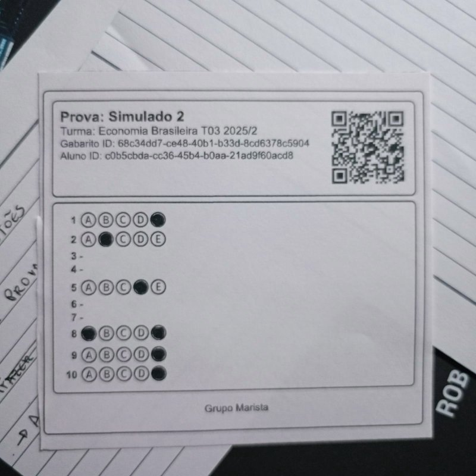

**2.1 Pré-processamento e Alinhamento**

A primeira etapa consiste no alinhamento da imagem para correção de distorções. O sistema utiliza o método findContours e a função contourArea para localizar o maior objeto na imagem, garantindo que o processamento foque exclusivamente na folha de gabarito. Através do approxPolyDP, a geometria dessa forma é simplificada para validar a presença de quatro vértices, confirmando que se trata de um quadrilátero. Uma vez identificado, o contorno é destacado com o drawContours, isolando a área de interesse.

Em seguida, o algoritmo organiza os pontos detectados e calcula as dimensões ideais da folha para determinar sua largura e altura máximas. Com esses dados, o getPerspectiveTransform gera uma matriz de mapeamento que correlaciona os pontos distorcidos a um plano retangular perfeito. O processo é finalizado com o warpPerspective, que aplica essa matriz para retificar a imagem, eliminando inclinações e gerando uma visão frontal padronizada, essencial para a precisão da leitura.

Resultado da imagem alinhada:
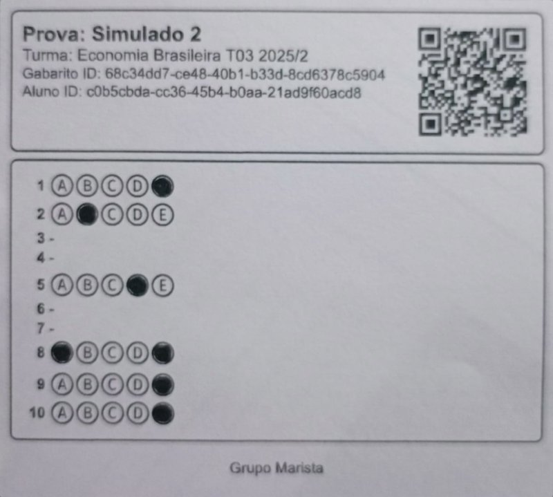

**2.2 Identificação do Modelo de Gabarito via QR Code**

Cada modelo de folha de gabarito possui um QR Code único contendo um UUID (Universally Unique Identifier). O sistema utiliza o detector de QR Code nativo do OpenCV (`cv2.QRCodeDetector()`) para localizar e decodificar este identificador. 

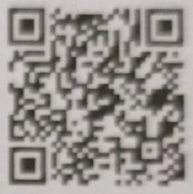

O UUID é então utilizado para consultar uma base de dados (local para fins de teste) que contém informações sobre a estrutura da folha: número de questões e quantidade de alternativas por questão. Estas informações auxiliam o pipeline a interpretar corretamente a disposição das alternativas.

```json
{
  "id" : "0a0f626a-56c5-4c8b-a62a-039dcf84d213",
  "studentId" : "e3a7c30d-cbd7-4512-aec1-da9841cdf0f1",
  "assessmentId" : "2b876ff0-d627-4b8d-80e5-48d05d8c251e",
  "batchId" : "cca55953-f8aa-4e6c-8ec5-b2b979a57d73",
  "generatedAt" : "06/10/2025 12:58",
  "generatedBy" : "Joh Doe",
  "questions" : [ {
    "number" : 1,
    "optionsCount" : 5
  }, {
    "number" : 2,
    "optionsCount" : 5
  },
  ...
}
```

**2.3 Detecção de Grupos de Questões**

Um modelo YOLO treinado especificamente para esta tarefa identifica as regiões da imagem que contêm grupos de alternativas. O modelo retorna bounding boxes (caixas delimitadoras) para cada grupo detectado. O treinamento foi realizado com um dataset customizado de imagens de gabaritos anotadas.

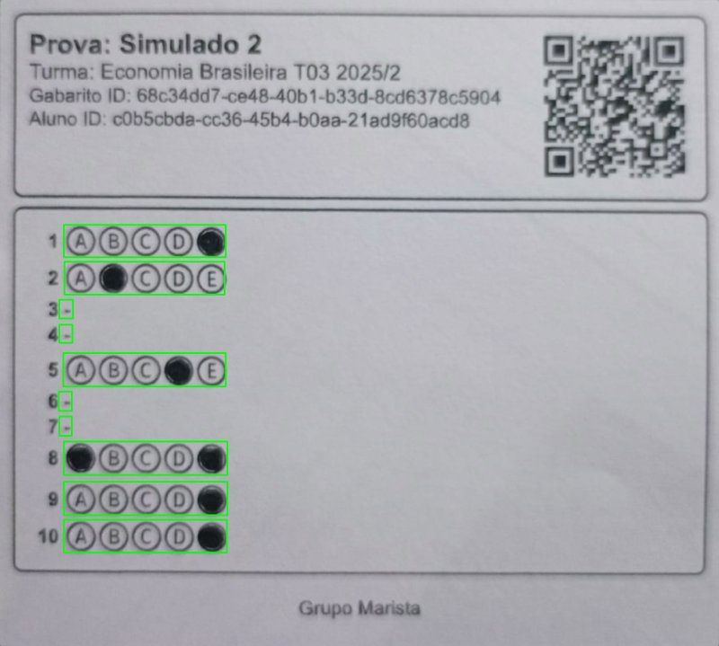

**2.4 Detecção de Círculos**

A detecção de círculos emprega uma abordagem híbrida. Primeiro, um modelo YOLO identifica círculos que apresentam alta probabilidade de estarem preenchidos. Em seguida, a Transformada Circular de Hough é aplicada para detectar todos os círculos na região de interesse, incluindo os não marcados. Os parâmetros da Transformada de Hough são calibrados com base nos círculos já detectados pelo modelo YOLO.

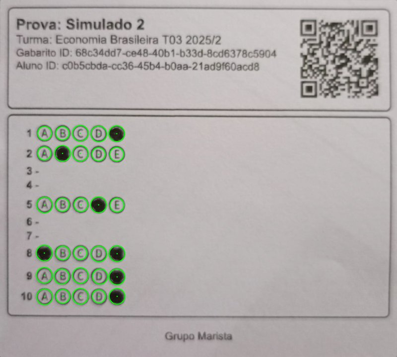

**2.5 Análise de Preenchimento**

Para cada círculo detectado, calcula-se a razão de preenchimento (fill ratio), que corresponde à proporção de pixels escuros dentro da área do círculo. Círculos com razão de preenchimento acima de um limiar (tipicamente 80%) são classificados como marcados. Esta etapa complementa a detecção do modelo YOLO, reduzindo falsos negativos.

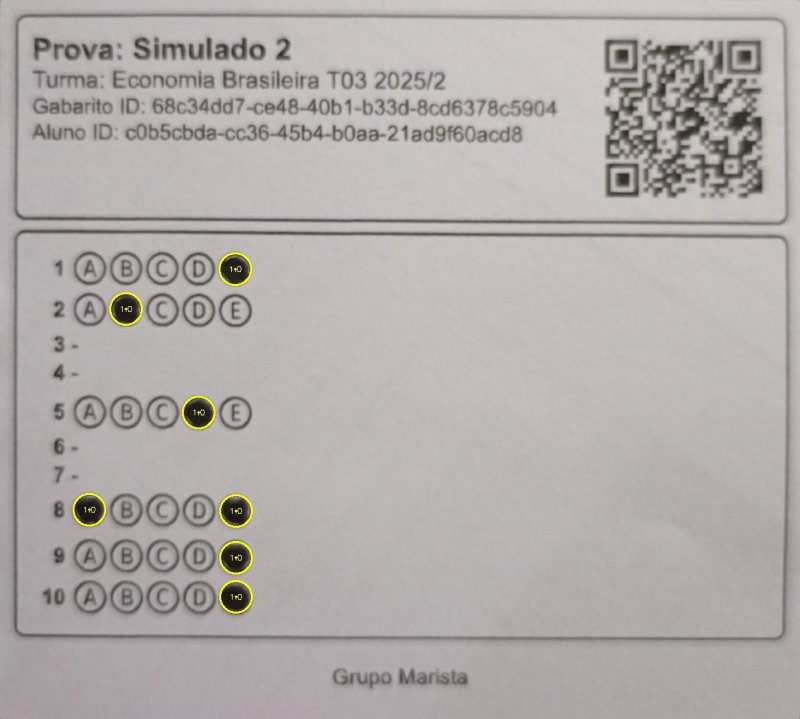

**2.6 Reconhecimento de Números**

O número de cada questão é reconhecido utilizando um modelo ensemble de machine learning treinado especificamente para esta tarefa. O processo de desenvolvimento deste componente envolveu três etapas principais: criação do dataset, anotação manual e treinamento do modelo.

**Criação do Dataset**: Um script automatizado processa imagens de folhas de gabarito utilizando o próprio pipeline de detecção de grupos de questões. Para cada grupo detectado, a região contendo o número da questão é identificada através da extensão das bounding boxes dos grupos de alternativas. Essas regiões são recortadas automaticamente e salvas como imagens individuais, cada uma associada a um identificador UUID único.

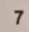
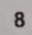

**Anotação Manual (Labelling)**: Os recortes extraídos foram anotados manualmente através de uma interface desenvolvida em Streamlit. Esta ferramenta de verificação permite visualizar cada imagem de número e atribuir o label correto (dígitos de 1 a 10), com navegação rápida por botões numéricos e atalhos de teclado para acelerar o processo de anotação. Os labels são salvos em arquivos JSON associados a cada imagem pelo UUID correspondente.

**Treinamento do Modelo**: O modelo final é um ensemble que combina três classificadores clássicos de machine learning: Random Forest, Gradient Boosting e Support Vector Machine (SVM), utilizando votação majoritária (hard voting) para a predição final. Durante o treinamento, técnicas de data augmentation são aplicadas para aumentar a robustez do modelo, incluindo rotações leves, deslocamentos, variações de brilho e contraste, e blur gaussiano. Cada imagem é redimensionada para 28x28 pixels e convertida em um vetor de features (flatten) antes de ser submetida ao classificador. O modelo treinado é serializado e salvo para uso em inferência.

**2.7 Inferência das Respostas**

Os círculos de cada grupo são ordenados por posição horizontal (coordenada X) e mapeados para as alternativas (A, B, C, D, E). Os círculos classificados como marcados determinam quais letras o aluno assinalou para aquela questão. O sistema contempla todos os cenários possíveis: uma única letra marcada, múltiplas letras marcadas (quando o aluno marca mais de uma alternativa), nenhuma letra marcada (questão em branco), ou falha na detecção (quando não é possível determinar com confiança o estado das marcações).

Nesse caso, 5 circulos detectados do grupo 1, sendo o ultimo (ordenado horizontalmente) marcado, resulta em E.

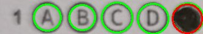

Nesse caso, 5 circulos detectados do grupo 8, sendo o primeiro e o ultimo (ordenado horizontalmente) marcados, resulta em A e E.

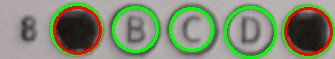

Sem alternativas marcadas:

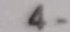

### 3. Resultados

O sistema foi desenvolvido e testado com datasets contendo imagens reais de gabaritos preenchidos em diferentes condições de iluminação e ângulos de captura. 

Resultado do processamento da imagem exemplo apresentado nesse relatorio:

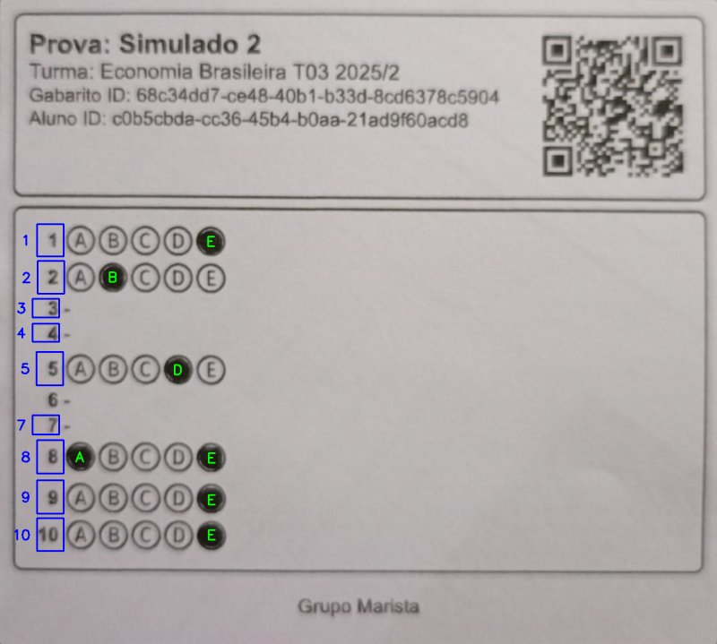

E a saida json ficou a seguinte:

```json
[
  {
    "question_number": 1,
    "marked_answers": [
      "E"
    ]
  },
  {
    "question_number": 2,
    "marked_answers": [
      "B"
    ]
  },
  {
    "question_number": 3,
    "marked_answers": []
  },
  {
    "question_number": 4,
    "marked_answers": []
  },
  {
    "question_number": 5,
    "marked_answers": [
      "D"
    ]
  },
  ...
]
```

Exemplo de resultado com numero variavel de alternativas por questao:
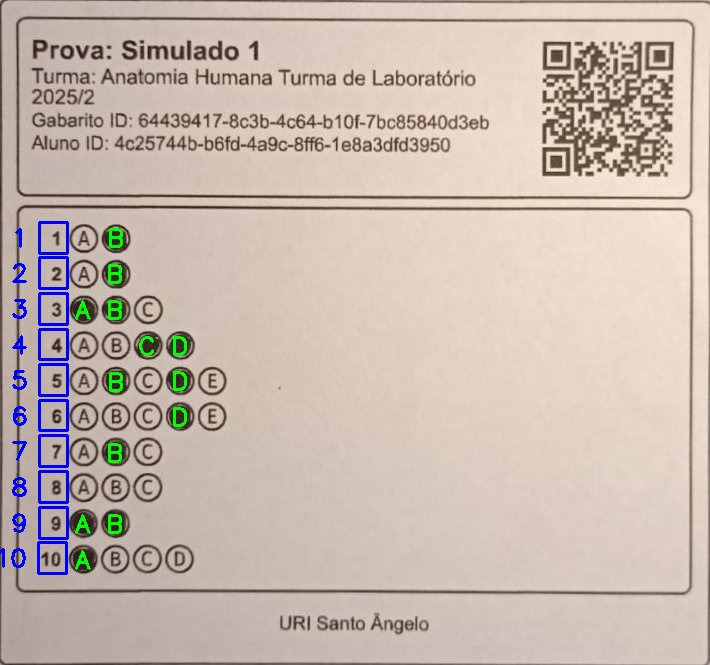


Exemplo de resultado com numero fixo (5) de alternativas por questao:
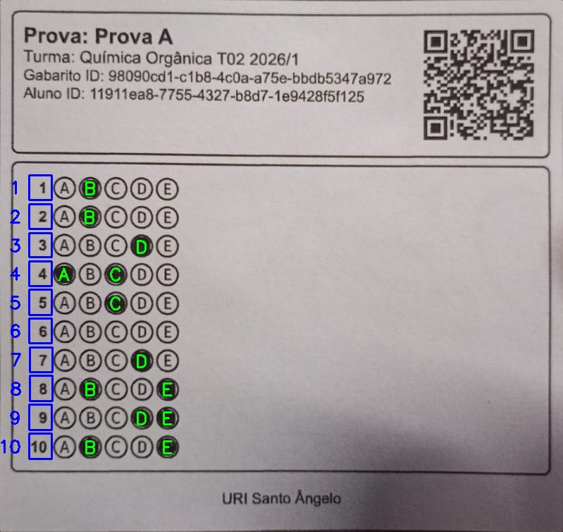

O dataset principal (datasetv2) contém 88 amostras com anotações ground truth em formato JSON.

**3.1 Desempenho do Pipeline**

O pipeline completo processa uma imagem de gabarito em tempo inferior a 2 segundos em hardware convencional, atendendo ao requisito de baixa latência. A maior parte do tempo é consumida pela inferência dos modelos YOLO e pela Transformada de Hough.

Resultados do script de teste (com Debugattor ativado):
```
Detection Metrics:
Answer keys correctly found: 88
Correct answers: 84
Errors: 4
Total images processed: 88
Overall accuracy: 95.45%

Performance Metrics:
Average execution time: 2.72 seconds
Max execution time: 4.55 seconds
Min execution time: 1.60 seconds
Total CPU time: 239.42 seconds
Wall time: 33.22 seconds
```

**3.2 Precisão na Detecção**

A combinação de detecção por modelo YOLO e análise de razão de preenchimento mostrou-se eficaz para identificar corretamente círculos marcados, mesmo em condições de preenchimento parcial ou borrado. A extensão das caixas de grupo para incluir a região dos números permite a correta associação entre número da questão e respostas.

**3.3 Sistema de Debug**

Um sistema de debug visual ([Debugattor](https://github.com/gustavoteixeirah/debugattor)) foi implementado para registro de artefatos intermediários em cada etapa do processamento. Este sistema facilita a identificação de problemas e a validação do funcionamento de cada componente do pipeline, gerando imagens anotadas e logs estruturados.

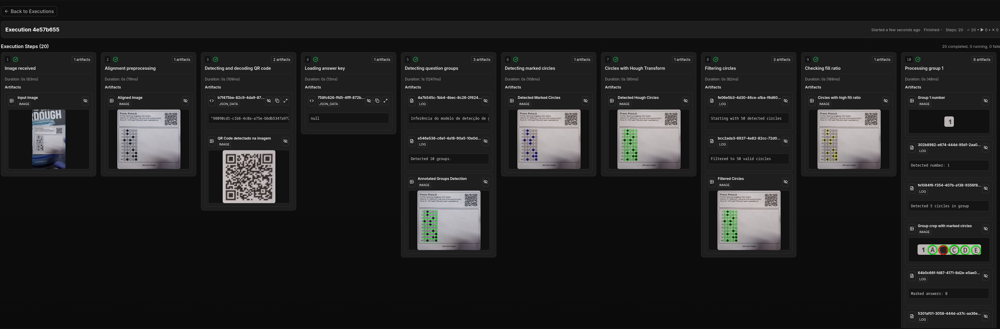
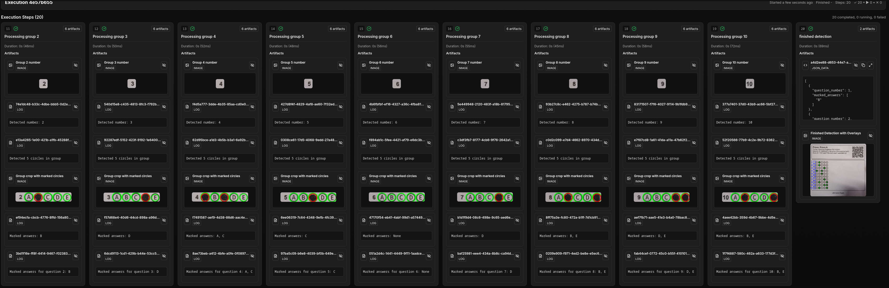


### 4. Conclusões

O sistema desenvolvido demonstra a viabilidade de implementar extração automática de respostas marcadas em folhas de gabarito utilizando técnicas modernas de visão computacional sem necessidade de hardware especializado. A combinação de técnicas clássicas e deep learning proporciona robustez e precisão na detecção das marcações.

Os principais diferenciais do sistema são: (1) capacidade de processar imagens capturadas por dispositivos móveis (o dataset foi criado a partir de fotos tiradas pelo whatsapp de maneira a simular o cenario real), democratizando o acesso à tecnologia OMR; (2) uso de QR Codes para identificação flexível de diferentes modelos de folha de respostas; (3) tratamento de múltiplos cenários de marcação (única, múltipla, nenhuma, ou falha); e (4) sistema de debug integrado que facilita o desenvolvimento e manutenção.

---

Matrícula: 241.100.413

Pontifícia Universidade Católica do Rio de Janeiro

Curso de Pós Graduação *Visão Computacional Master*

